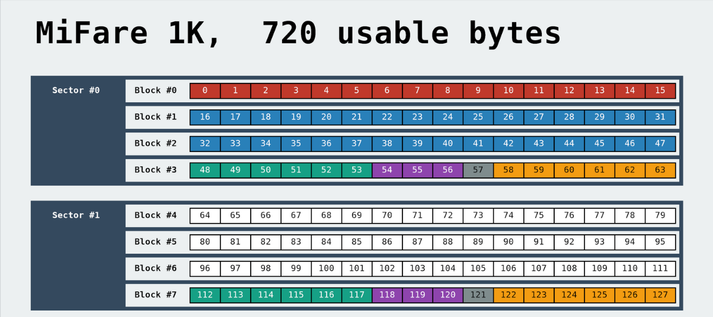
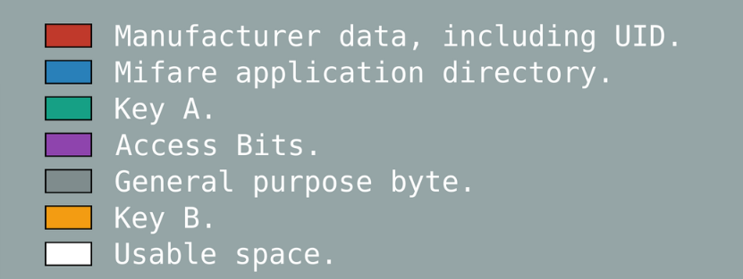

# Fun With Proxmark3
**Ou como clonar o passe de ônibus :P** 
(Para propósitos puramente didáticos, claro)

# Introdução
**RFID** 
**R**adio-**F**requency **ID**entification, ou identificação por radiofrequência é um método de identificação automática, em que dados, transmitidos por tags RFID através de ondas de rádio, são captados por um leitor. Tags RFID são compostas por, no mínimo, uma antena, responsável por receber sinais de interrogação do leitor e transmitir respostas da tag, e um chip, ou circuito, que armazena e gerencia os dados gravados na tag. Sistemas RFID operam em diferentes frequências e são amplamente utilizados em diversas aplicações, como cartões de identificação, rastreamento de objetos e animais, pagamentos por aproximação e tarifas automáticas em pedágios ou, como veremos adiante, passes de ônibus. 
Mais informações sobre RFID [aqui](https://en.wikipedia.org/wiki/Radio-frequency_identification)

**MIFARE** 
MIFARE é uma série de chips de circuito integrado usados em cartões de proximidade, baseada em vários níveis do padrão ISO/IEC 14443 Type-A, operando em 13.56 MHz (hf, high frequency). Existem várias versões de tags MIFARE, mas, no geral, seus dados são divididos em blocos, esses agregados em setores, protegidos por chaves.

 

Mais notavelmente, o bloco 0 é reservado para o ID único de cada tag (UID) e demais informações de fabricação, e o quarto bloco de cada setor para suas chaves e bits de acesso. Cada uma das chaves (A e B) pode ser associada a diferentes níveis de permissão para o setor, como somente leitura ou leitura e escrita. Basicamente, um leitor só pode ler ou escrever em um setor de alguma tag caso possua a(s) chave(s) correta(s) para aquele setor (e as condições de acesso, definidas pelos bits de acesso permitam). 
Mais informações sobre MIFARE [aqui](https://en.wikipedia.org/wiki/MIFARE)

**Proxmark** 
Proxmark é um dispositivo que permite ler, escrever e simular tags RFID e farejar comunicações entre leitor e tag, e suporta tags lf e hf (low frequency [120-150 kHz] e high frequency [13.56 MHz]).

Firmware utilizado: Iceman Fork - Proxmark3, disponível [aqui](https://github.com/RfidResearchGroup/proxmark3)

# Agora sim - o exploit
