# Fun With Proxmark3
**Ou como clonar o passe de ônibus :P** 
(Para propósitos puramente didáticos, claro)

# Introdução
**RFID** 
**R**adio-**F**requency **ID**entification, ou identificação por radiofrequência é um método de identificação automática, em que dados, transmitidos por tags RFID através de ondas de rádio, são captados por um leitor. Tags RFID são compostas por, no mínimo, uma antena, responsável por receber sinais de interrogação do leitor e transmitir respostas da tag, e um chip, ou circuito, que armazena e gerencia os dados gravados na tag. Sistemas RFID operam em diferentes frequências e são amplamente utilizados em diversas aplicações, como cartões de identificação, rastreamento de objetos e animais, pagamentos por aproximação e tarifas automáticas em pedágios ou, como veremos adiante, passes de ônibus. 
Mais informações sobre RFID [aqui](https://en.wikipedia.org/wiki/Radio-frequency_identification)

**MIFARE** 
MIFARE é uma série de chips de circuito integrado usados em cartões de proximidade, baseada em vários níveis do padrão ISO/IEC 14443 Type-A, operando em 13.56 MHz (hf, high frequency). Existem várias versões de tags MIFARE, mas, no geral, seus dados são divididos em blocos, esses agregados em setores, protegidos por chaves.

 

Mais notavelmente, o bloco 0 é reservado para o ID único de cada tag (UID) e demais informações de fabricação, e o quarto bloco de cada setor para suas chaves e bits de acesso. Cada uma das chaves (A e B) pode ser associada a diferentes níveis de permissão para o setor, como somente leitura ou leitura e escrita. Basicamente, um leitor só pode ler ou escrever em um setor de alguma tag caso possua a(s) chave(s) correta(s) para aquele setor (e as condições de acesso, definidas pelos bits de acesso, permitam). 
Mais informações sobre MIFARE [aqui](https://en.wikipedia.org/wiki/MIFARE)

**Proxmark** 
Proxmark é um dispositivo que permite ler, escrever e simular tags RFID e farejar comunicações entre leitor e tag, e suporta tags lf e hf (low frequency [120-150 kHz] e high frequency [13.56 MHz]).

Firmware utilizado: Iceman Fork - Proxmark3, disponível [aqui](https://github.com/RfidResearchGroup/proxmark3)

# Agora sim - o exploit
**Objetivo**: encontrar alguma vulnerabilidade em um sistema RFID. 
**Sistema escolhido**: passe de ônibus; cartão de aproximação.  
Com o proxmark conectado a uma porta USB, podemos acessar sua interface com o comando `pm3`

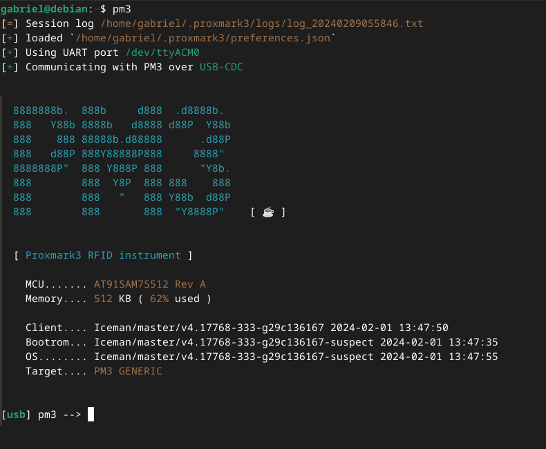

Com o cartão posicionado em cima do proxmark e o comando `auto` podemos identificar com que tipo de tag estamos lidando

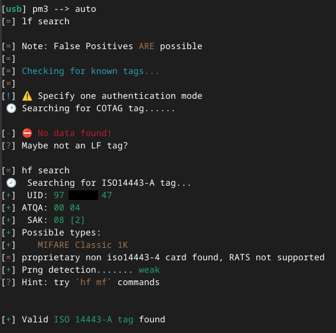

O proxmark identificou que se trata de um cartão MIFARE Classic 1K o qual é divido em 16 setores de 4 blocos cada, ou seja, precisamos de 16 * 2 = 32 chaves para pwná-lo. A boa notícia é que o proxmark também detectou que o prng (pseudo-random number generator) do cartão é fraco, o que significa que esse está sujeito a certos ataques: 
**Darkside**: explora vulnerabilidades na implementação de criptografia CRYPTO-1 para tentar encontrar uma chave 
**Nested**: ou ataque aninhado, que utiliza uma chave conhecida para encontrar as demais 
Sigo o conselho do proxmark e uso o comando `hf mf chk`, que testa chaves padrão nos setores da tag

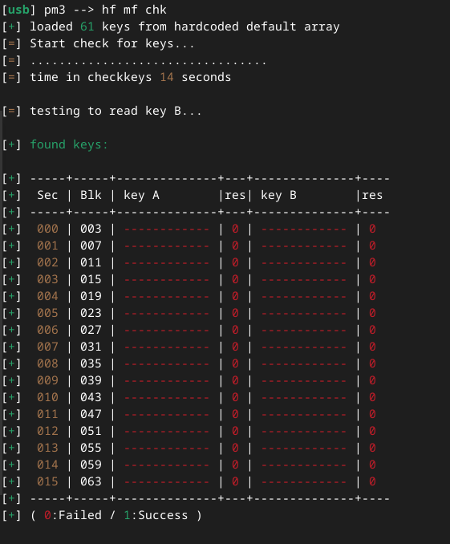

Infelizmente não encontramos nenhuma :/. Tento apelar pro `hf mf autopwn`, que roda todos os ataques possíveis

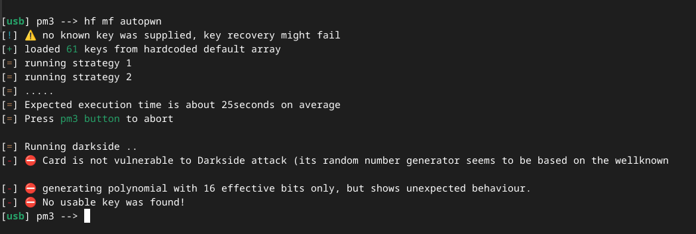

mas aparentemente esse cartão é imune ao darkside, e sem nenhuma chave não conseguimos rodar um ataque aninhado. Nesse ponto achei que teria que pegar meu computador, proxmark e cartão do ônibus, me aventurar no mundo real, possivelmente tocar na grama e quem sabe conseguir farejar um trace enquanto o motorista tenta me expulsar por "hackear o ônibus". Felizmente, o comando `hf mf chk` permite a entrada de dicionários de chaves como argumento, e, utilizando o dicionário fornecido no repositório do firmware, [aqui](https://github.com/RfidResearchGroup/proxmark3/blob/master/client/dictionaries/mfc_default_keys.dic), temos...

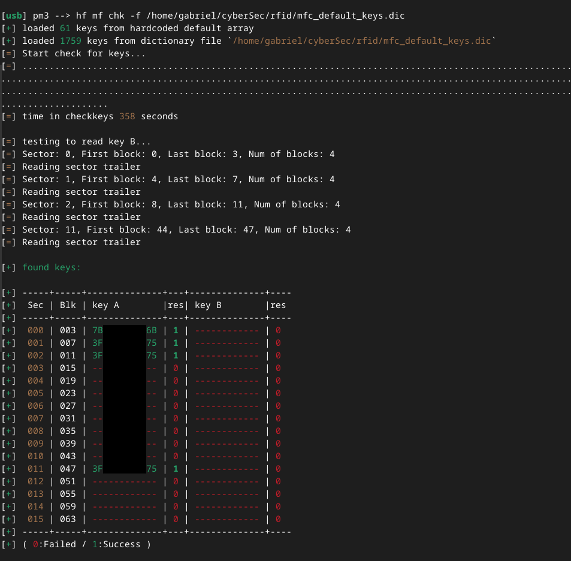

...chaves! Só algumas, mas uma já é o suficiente. Com isso, conseguimos rodar o `hf mf nested`

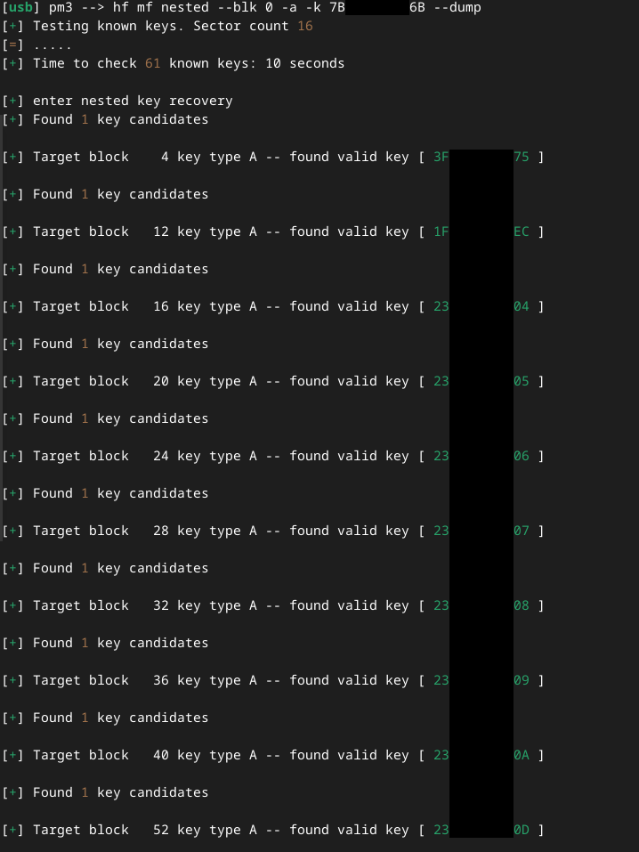

. . .

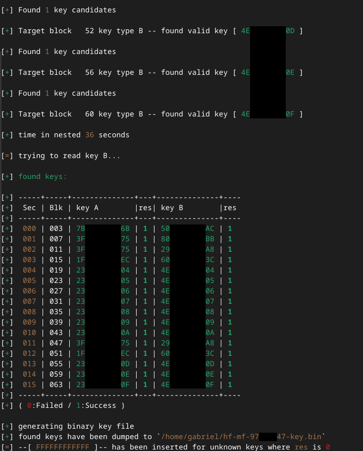

Conseguindo assim todas as chaves. Muito bonito ver todo esse texto verde xD. Agora só falta fazer o dump do cartão

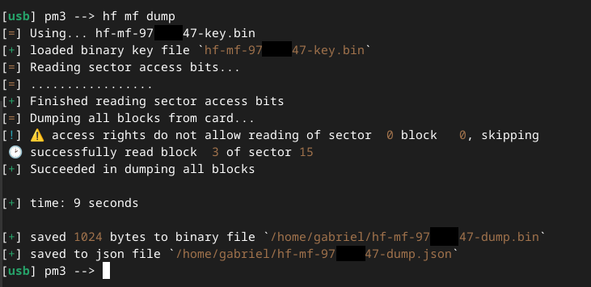

E carregar o dump em um cartão mágico (cartão que simula uma tag MIFARE, mas que permite ter seu UID editado).

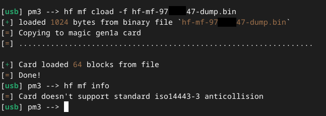

As condições de acesso não permitiram copiar o bloco 0 do setor 0, que contém o UID do cartão original, por isso o erro na leitura. Mas tudo bem, podemos reconstruir esse bloco, pois sabemos o UID

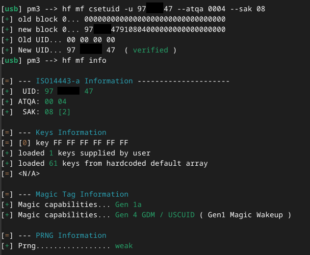

Para comparar com o original:

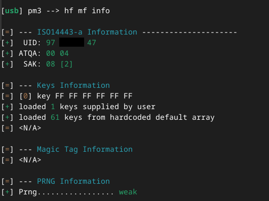

E é isso, cartão clonado :). Fazendo alguns testes no Mundo RealTM (estação de recarga automática), descobri que o saldo é armazenado no próprio cartão, ou seja, deve ser possível editá-lo. Mas isso fica pra uma próx(mark)ima

# Fontes
https://en.wikipedia.org/wiki/Radio-frequency_identification 
https://en.wikipedia.org/wiki/MIFARE 
https://luemmelsec.github.io/gaylord-M-FOCker-ready-to-pwn-your-MIFARE-tags/ 
https://jjensn.com/mifare-easy-targets 
https://github.com/RfidResearchGroup/proxmark3 
https://www.youtube.com/@iceman1001
